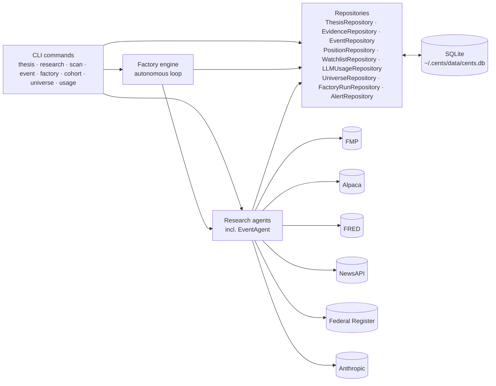
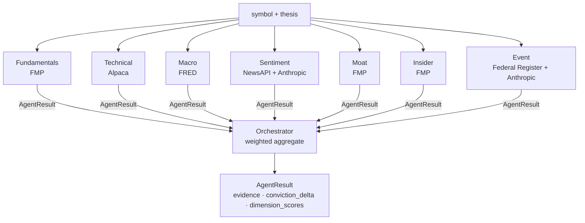
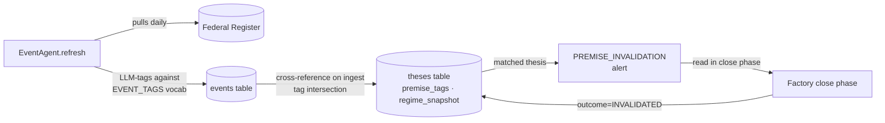
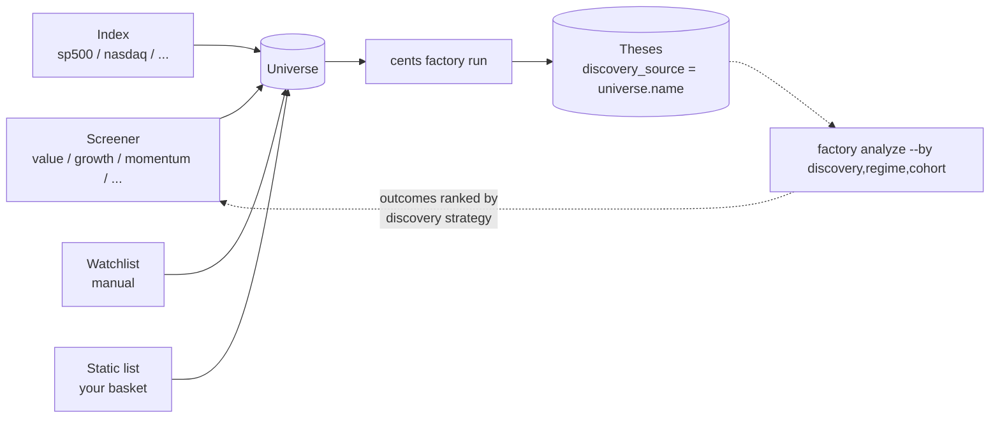
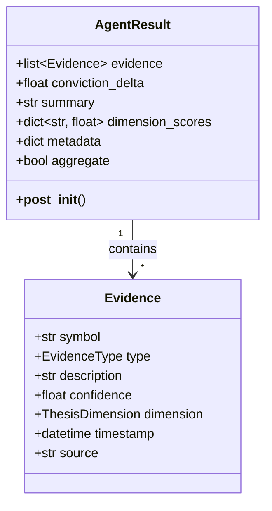

Cents is intentionally boring on the storage layer: SQLite, repository
pattern, no daemon. The interesting parts are (1) the agent
orchestration, (2) the regime-aware substrate that ties events to
theses, (3) the autonomous factory loop on top, and (4) the
experiments registry that pre-registers hypotheses against a frozen
factory.toml SHA so analytics stay falsifiable.

The factory engine **records** what happens — it does not **gate** on
trading-style controls. Drawdown, liquidity, borrow, beta-matched
hedging, and calibrated-p are computed on every thesis but never block
an open. `cents/finance/` is a transversal utility library for callers
writing their own analytics, not a set of gates the engine relies on.
See [Scope](/scope/).

## Data flow

CLI commands hit repositories, which talk to a single SQLite database.
External data providers are called from the agents only — the
persistence layer never reaches out to the network.



The repository pattern accepts an optional `conn` so tests can inject an
in-memory SQLite connection — see `tests/conftest.py` for the fixtures.

Every Anthropic call routes through `record_llm_usage()` which persists
a row to the `llm_usage` table, so `cents usage summary` can break
spend down by agent / model / day / operation.

## Agent orchestration

The orchestrator runs every child agent, collects their `AgentResult`s,
and folds them into a single weighted synthesis.



The orchestrator's weighting combines two factors:

- **Confidence weight** — each evidence item carries a `confidence` in
  `[0, 1]`; the agent's mean evidence confidence scales its conviction
  delta.
- **Age decay** — evidence weight decays linearly from `1.0` toward a
  `0.1` floor over a per-dimension TTL (7 days for technical/sentiment,
  30 days for macro/valuation/risk, 90 days for quality/moat).

A per-agent clamp of ±10 conviction points keeps any single agent from
dominating the result. The orchestrator's _own_ aggregate result uses a
higher cap of ±30, so a strong-consensus signal isn't quantized to ±10
by the per-agent clamp.

### The control arm: RandomOrchestrator

`cents factory run --orchestrator random` swaps the multi-agent
orchestrator above for `RandomOrchestrator`
(`cents/agents/random_orchestrator.py`), which emits a uniform-random
`conviction_delta` in `[-30, +30]` with no LLM calls. Theses opened by
this orchestrator are stamped with `orchestrator_label = "random"` so
cohort analytics can compare the LLM arm against a matched-cadence
baseline run on the same universe. Without this, no cohort spread the
LLM arm produces can be attributed to the LLM signal versus the act of
opening theses in whatever tape happened to be running. The seed
parameter makes runs reproducible.

## Pre-registered experiments

`cents experiment register <spec.yaml>` writes an `Experiment` row that
freezes the current `factory.toml` SHA + body, plus a hypothesis,
primary metric, and `minimum_n_per_arm` target. While the experiment is
active, the factory engine stamps `experiment_id` on every opened
thesis. `cents experiment status` tracks progress against the target;
`cents experiment finalize <name>` locks the run with an optional
verdict JSON. This is the surface that makes the analytics falsifiable
rather than post-hoc storytelling — see
[`cents experiment`](/commands/experiment/) for the workflow.

## The regime-aware substrate

Three primitives turn cents from a research tool into a regime-aware
research tool:



- **`Thesis.premise_tags`** — the regime variables a thesis depends on
  (e.g. `["tariffs.china", "ai_capex"]`), drawn from the controlled
  vocabulary `EVENT_TAGS`.
- **`Thesis.regime_snapshot`** — the regime context at thesis birth:
  recent event count, top tag counts, net polarity. Stored as JSON
  for later cohort-stratified analytics.
- **`AlertType.PREMISE_INVALIDATION`** — fires when an ingested event's
  tags intersect an open thesis's `premise_tags`. Carries
  `data.thesis_id` and `data.matched_tags`. The factory's close phase
  reads these and closes matching theses as `INVALIDATED`.

See [Events & premise invalidation](/events/) for the full mechanics.

## Discovery → factory: the full loop

The factory walks a universe of symbols. Where does that universe come
from? In v1 it can be supplied four ways — and the most interesting one
is a [screener](/screeners/), which makes discovery a measurable,
swappable component instead of a hard-coded list:



The dashed feedback loop is what makes the discovery layer *learnable*.
Every thesis records the universe (and hence the screener) that
produced its symbol; `cents factory analyze --by discovery` later
stratifies outcomes by that source. After enough closes, the system can
tell you which discovery strategies actually produce winning theses in
which regimes.

## The factory loop in detail

The factory walks a universe of symbols, opens paper theses where the
orchestrator clears the entry threshold (paired with sector-ETF twins
in paired mode), closes positions on target / stop / horizon /
premise-invalidation, and writes a structured run log.

```mermaid
flowchart TB
  Run[cents factory run]
  RefreshEv[refresh events<br/>EventAgent.refresh]
  Close{close phase}
  PremiseAlert{PREMISE_INVALIDATION<br/>alert?}
  TargetStop{target / stop / horizon?}
  CloseTh[close thesis<br/>record outcome reason]
  Universe[(universe symbols)]
  Open{open phase}
  Orchestrator[run orchestrator]
  Threshold{|delta| ≥ threshold?}
  Premise[classify premise tags<br/>LLM call]
  Concentration{premise tag at cap?}
  Budget{budget OK or preempt?}
  OpenTh[create thesis<br/>open positions]
  Record[record run<br/>llm cost, counts]

  Run --> RefreshEv
  RefreshEv --> Close
  Close -->|for each open thesis| PremiseAlert
  PremiseAlert -->|yes| CloseTh
  PremiseAlert -->|no| TargetStop
  TargetStop -->|yes| CloseTh
  TargetStop -->|no| Open
  Close --> Open
  Open -->|for each symbol| Orchestrator
  Orchestrator --> Threshold
  Threshold -->|no| Open
  Threshold -->|yes| Premise
  Premise --> Concentration
  Concentration -->|hit| Open
  Concentration -->|ok| Budget
  Budget -->|no fit, no preempt| Open
  Budget -->|fits or preempts lower-conviction| OpenTh
  OpenTh --> Open
  Open --> Record
```

Key contracts:

- The close phase respects a same-run **cooldown**: a symbol closed as
  `INVALIDATED` won't be re-opened in the same run (its hedge symbol
  too).
- Direction follows signal sign: bullish delta opens LONG underlying,
  bearish opens SHORT underlying; hedges (in paired mode) sit
  opposite. Target / stop semantics flip accordingly.
- Preemption is conviction-weighted: a new thesis can displace the
  lowest-conviction open thesis only if `new_conviction >
  lowest_open.conviction + preemption_margin`. Displaced thesis closes
  as `PREEMPTED` (stratified out of win-rate analytics).
- LLM cost on `factory_runs.llm_cost_usd` is computed by diffing
  `llm_usage` rows where `called_at` falls in `[started_at,
  completed_at]`, priced via `cents.pricing.estimate_cost_usd`.

See [Factory](/factory/) for the operating rules and budget mechanics
in detail.

## The finance/ utility substrate

`cents/finance/` is a transversal utility library. Each module exposes
primitives the factory **could** gate on but **deliberately doesn't** in
the default research configuration. They exist so analytics callers can
stratify outcomes by these dimensions, and so users who want trading-
shaped behaviour can opt in explicitly.

| Module | What it provides | Opt-in via |
| --- | --- | --- |
| `sizing.py` | `vol_scaled_shares` — inverse-vol sizing toward a target $-vol fraction. | `sizing_mode = "vol_scaled"` (default: `"equal_dollar"`) |
| `costs.py` | `apply_open_cost` / `apply_close_cost` — commission + slippage + borrow + gap penalty. | Always on — research honesty, applied so `Position.pnl` is net of costs. Cohort analytics should always use `pnl`, not `gross_pnl`. |
| `hedging.py` | `estimate_beta` + `beta_match_ratio` — 60-day OLS beta vs hedge ETF, refuses estimation when R² < threshold. | `beta_match_hedge = true` (default: `false`, dollar-matched) |
| `liquidity.py` | `passes_liquidity_gate` / `passes_borrow_gate` — utilities only; the engine never skips on them. | Analytics callers — never used as a gate in the default engine. |
| `portfolio.py` | `compute_drawdown` + `check_kill_switch` — utilities only; the engine never halts on them. | Analytics callers — never used as a gate in the default engine. |
| `calibration.py` | `CalibrationModel` + `fit_calibration` — logistic regression on outcomes. | Recorded on every thesis as `calibrated_p_correct`; the engine never skips on it. |

The split between "recorded" and "gated" is deliberate. The point of
the research pipeline is to study what happens at every conviction
level / drawdown / liquidity tier, not to filter the dataset to the
tier that looks best ex-ante.

## The AgentResult contract

Every agent — including the orchestrator and EventAgent — returns the
same dataclass. This is the surface the HTML export, the JSON
serializer, and the CLI all consume.



- `evidence` — every supporting / contradicting / neutral observation
  the agent generated, including a numeric confidence and the
  dimension it speaks to.
- `conviction_delta` — clamped in `__post_init__`. The cap is ±10
  (`MAX_CONVICTION_DELTA`) for individual agents and ±30
  (`MAX_AGGREGATE_CONVICTION_DELTA`) when `aggregate=True` (the
  orchestrator).
- `dimension_scores` — per-dimension contributions (valuation, quality,
  moat, technical, risk, macro, sentiment).
- `summary` — human-readable string surfaced in CLI output.
- `metadata` — escape hatch for agent-specific extras (signal mode
  flags, raw provider responses for debugging).
