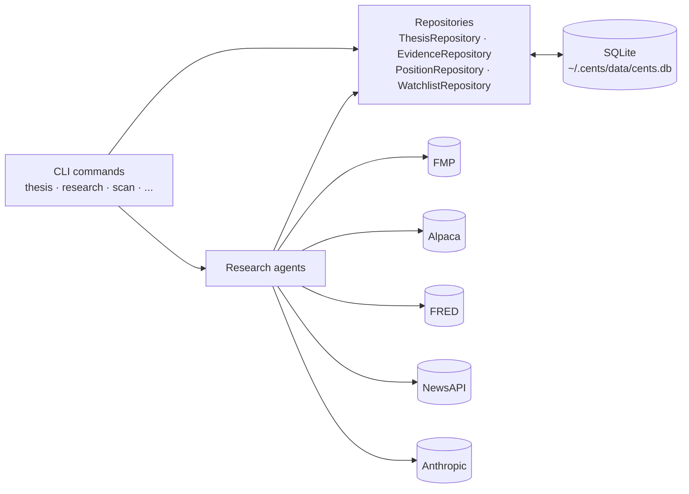
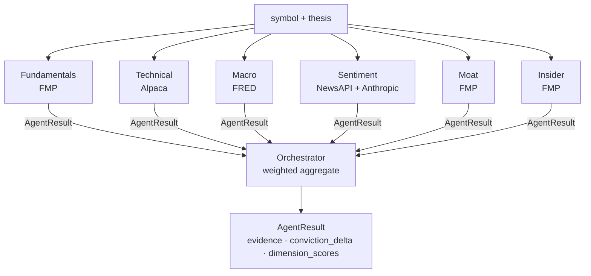
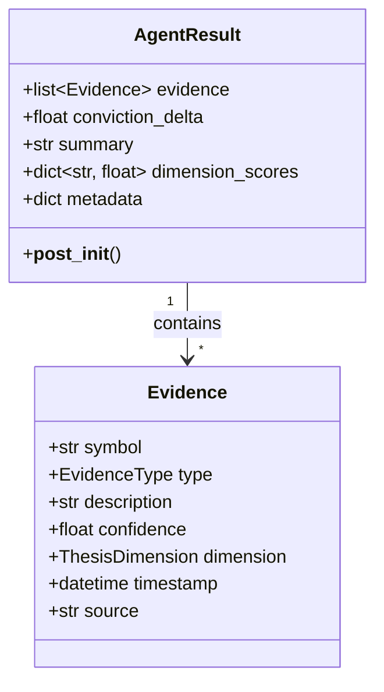

Cents is intentionally boring on the storage layer: SQLite, repository
pattern, no daemon. The interesting part is the agent orchestration and
the `AgentResult` contract that every research agent returns.

## Data flow

CLI commands hit repositories, which talk to a single SQLite database.
External data providers are called from the agents only — the persistence
layer never reaches out to the network.

The repository pattern accepts an optional `conn` so tests can inject an
in-memory SQLite connection — see `tests/conftest.py` for the fixtures.

## Agent orchestration

The orchestrator runs every child agent, collects their `AgentResult`s, and
folds them into a single weighted synthesis.

The orchestrator's weighting combines two factors:

- **Confidence weight** — each evidence item carries a `confidence` in
  `[0, 1]`; the agent's mean evidence confidence scales its conviction
  delta.
- **Age decay** — evidence weight decays linearly from `1.0` toward a
  `0.1` floor over a per-dimension TTL (7 days for technical/sentiment,
  30 days for macro/valuation/risk, 90 days for quality/moat).

A per-agent clamp of ±10 conviction points keeps any single agent from
dominating the result.

## The AgentResult contract

Every agent — including the orchestrator — returns the same dataclass. This
is the surface the HTML export, the JSON serializer, and the CLI all
consume.

- `evidence` — every supporting / contradicting / neutral observation the
  agent generated, including a numeric confidence and the dimension it
  speaks to.
- `conviction_delta` — clamped to ±10 in `__post_init__`.
- `dimension_scores` — per-dimension contributions (valuation, quality,
  moat, technical, risk, macro, sentiment).
- `summary` — human-readable string surfaced in CLI output.
- `metadata` — escape hatch for agent-specific extras (signal mode flags,
  raw provider responses for debugging).
